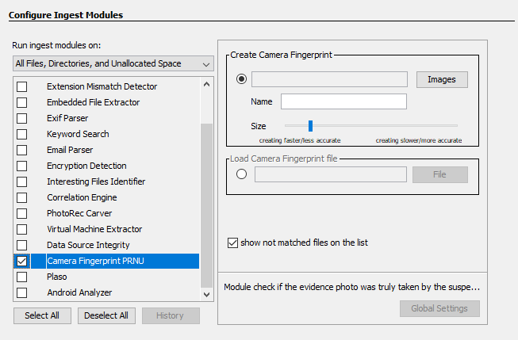

# Camera Fingerprit PRNU
An Autopsy module, that checks if a photo was truly taken by a suspected camera or not.

## Table of contents
* [General info](#general-info)
* [Screenshots](#screenshots)
* [Technologies](#technologies)
* [Setup](#setup)
* [Usage](#usage)
* [Inspiration](#inspiration)
* [Contact](#contact)

## General info
Camera Fingerprint PRNU uses the photo response non-uniformity of camera sensor (PRNU) to check if a photo was truly taken by a suspected camera or not. Module is not based on metadata such as EXIF, performs a physical analysis of the camera sensor, determines photo response non-uniformity (PRNU), uses the principle that each sensor pixel behaves differently with effects such as non-uniform photo response, making each sensor is unique, identifies each pixel anomaly and uses this information to create a description of the camera sensor - the camera fingerprint.

## Screenshots

## Technologies
* Windows OS
* Autopsy - version 4.15.0
* Apache NetBeans IDE - version 9.0
* Python - version 3.6.0

## Setup
Installation:
1. Download file org-gbies-camerafingerprint.nbm from https://github.com/ernestbies/Camera-Fingerprint-PRNU/blob/master/build.
2. Run Autopsy.
3. Go to Tools -> Plugins -> Downloaded -> Add Plugins.
4. Choose file org-gbies-camerafingerprint.nbm.
5. Click Install.
6. Follow the steps, restart Autopsy.

Uninstallation:
1. Run Autopsy.
2. Go to Tools -> Plugins -> Installed.
3. Select Camera Fingerprint PRNU.
4. Click Uninstall.
5. Follow the steps, restart Autopsy.

## Usage
1. Take reference photos of white surfaces (walls or clouds) with the suspected camera so that the module creates the camera fingerprint.
1. Add evidence photos to Data Source.
2. Select directory with reference photos and enter the camera fingerprint name.
3. You can increase the fingerprint size to increase accuracy.
4. If the camera fingerprint has been created before, you can load it from file (.cfp).
5. Case Study: https://www.youtube.com/watch?v=3V9MfSZSL-s.

## Inspiration
Project based on https://github.com/polimi-ispl/prnu-python

## Contact
Created by Grzegorz Bieś [g.bies@poczta.fm] & Ernest Bieś [ernestbies@gmail.com]
